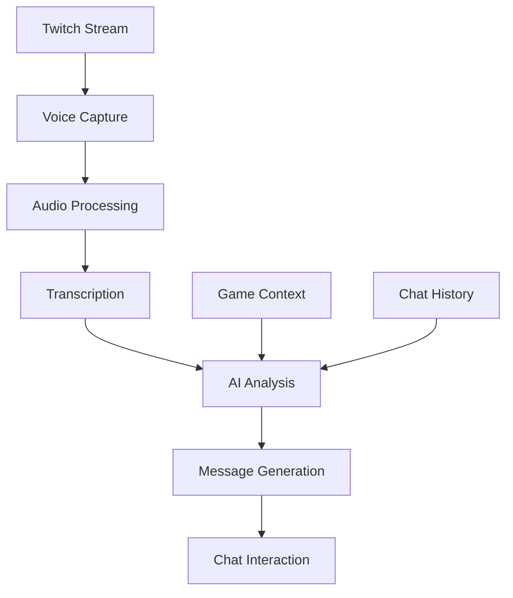

<div align="center">

# 🎮 Twitch AI Viewers 🤖

[](https://nodejs.org/)
[](https://www.typescriptlang.org/)
[](LICENSE)
[](https://discord.gg/p6X5R3p9)

> 🎥 **Never Stream Alone Again!** Twitch AI Viewers is your perfect companion for those early streaming days. Whether you're just starting out or looking to make your stream more engaging, this bot provides intelligent, context-aware viewers that interact naturally with your content.

</div>

## ✨ Features & Benefits

<div align="center">

| 🎤 Audio Processing | 🤖 AI Integration | 💬 Chat Interaction | ⚙️ Configuration |
|-------------------|------------------|-------------------|-----------------|
| Real-time capture | Smart transcription | Natural responses | Flexible settings |
| Auto format conversion | Context-aware messages | Emoji support | Easy setup |
| Noise reduction | Multi-language support | Anti-spam system | Error handling |

</div>

<div align="center">

| 🎯 Perfect For | 🌟 Key Benefits |
|----------------|-----------------|
| 👶 New Streamers | Build confidence with your first virtual audience |
| 🎮 Small Communities | Keep your chat active and engaging |
| 🎥 Content Creators | Test new content with AI feedback |
| 🌍 Language Learners | Practice streaming in different languages |

</div>

## 🚀 Getting Started

<div align="center">

| Step | Action | Details |
|------|--------|---------|
| 1. Prerequisites | Requirements | [Node.js](https://nodejs.org/) (v14+), [Twitch Dev Account](https://dev.twitch.tv/console), [Groq API Key](https://groq.com/) |
| 2. Installation | Clone & Setup | ```bash
git clone https://github.com/gsilvamartin/twitch-ai-viewers.git
cd twitch-ai-viewers
npm install
``` |
| 3. Configuration | Environment | Create `.env` file with:
```env
# Twitch Credentials
TWITCH_CLIENT_ID=your_client_id
TWITCH_CLIENT_SECRET=your_client_secret

# Bot Settings
BOT_USERNAME=your_bot_username
BOT_OAUTH_TOKEN=oauth:your_token

# AI Settings
GROQ_API_KEY=your_groq_api_key
ORIGINAL_STREAM_LANGUAGE=en

# Time Settings
TRANSCRIPT_DURATION=60000
MESSAGE_INTERVAL=5000
``` |
| 4. Run | Development | ```bash
npm run dev
``` |

</div>

## 🤖 How It Works

<div align="center">



</div>

<div align="center">

| Component | Description | Features |
|-----------|-------------|----------|
| Voice Capture | Audio Processing | FFmpeg, Real-time, Multi-format |
| Speech Recognition | Transcription | Whisper, Multi-language, Noise handling |
| AI Message Generation | Response Creation | Context-aware, Game-specific, Natural flow |
| Chat Interaction | Message Delivery | Multiple bots, Anti-spam, Rate limiting |

</div>

## 🛠️ Tech Stack

<div align="center">

| Category | Technology | Badge |
|----------|------------|-------|
| Runtime | Node.js |  |
| Language | TypeScript |  |
| Audio | FFmpeg |  |
| AI | Groq |  |
| Chat | Twitch |  |

</div>

## 📝 Project Structure

<div align="center">

| Directory | File | Purpose |
|-----------|------|---------|
| `src/` | `main.ts` | Application entry point |
| | `bot.ts` | Twitch bot logic |
| | `ai.ts` | AI service and audio processing |
| | `logger.ts` | Logging utility |
| Root | `package.json` | Project dependencies |
| | `tsconfig.json` | TypeScript configuration |
| | `.env` | Configuration file |

</div>

## 🤝 Contributing

<div align="center">

[](CONTRIBUTING.md)
[](https://github.com/gsilvamartin/twitch-ai-viewers/issues)

</div>

<div align="center">

| Step | Action | Command |
|------|--------|---------|
| 1. Fork | Create your copy | Click "Fork" button |
| 2. Branch | Create feature branch | ```git checkout -b feature/AmazingFeature``` |
| 3. Commit | Save your changes | ```git commit -m 'Add some AmazingFeature'``` |
| 4. Push | Upload changes | ```git push origin feature/AmazingFeature``` |
| 5. PR | Create Pull Request | Click "New Pull Request" |

</div>

---

<div align="center">

Made with ❤️ by [Guilherme Martin](https://github.com/gsilvamartin)

</div>
