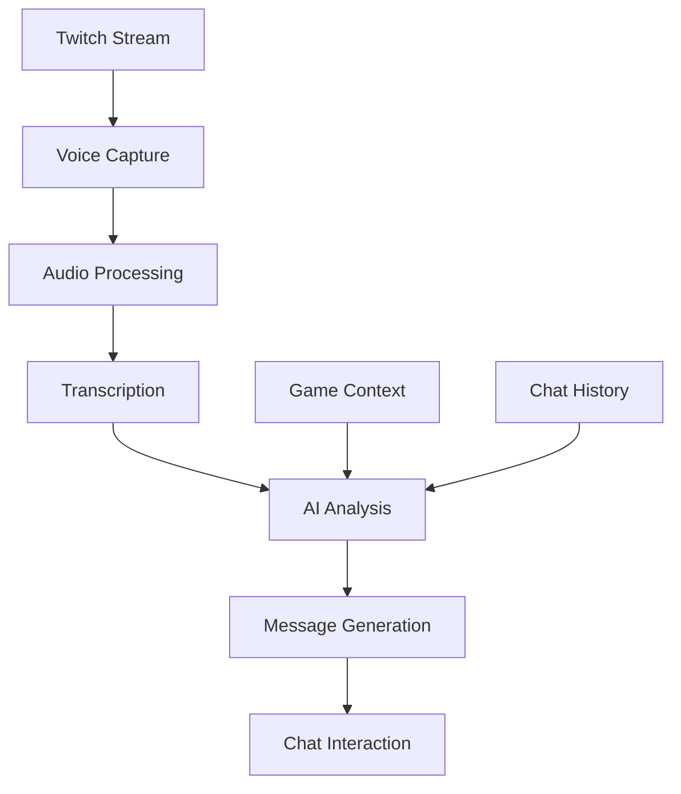

<div align="center">

# 🎮 Twitch AI Viewers 🤖

[](https://nodejs.org/)
[](https://www.typescriptlang.org/)
[](LICENSE)
[](https://discord.gg/p6X5R3p9)

> 🎥 **Never Stream Alone Again!** Twitch AI Viewers is your perfect companion for those early streaming days. Whether you're just starting out or looking to make your stream more engaging, this bot provides intelligent, context-aware viewers that interact naturally with your content.

> 🤖 **Your First Virtual Audience** - Perfect for new streamers who want to build confidence and create a welcoming atmosphere. The AI viewers engage with your content, respond to your commentary, and help create a more dynamic streaming experience.

> 💡 **Why Use Twitch AI Viewers?**
> - 🎯 Perfect for new streamers building their community
> - 🤝 Never feel like you're talking to an empty chat
> - 🎮 Natural interactions that respond to your gameplay
> - 🎤 Context-aware responses to your commentary
> - 🌟 Create a more engaging streaming environment


</div>

## ✨ Features

<div align="center">

| 🎤 Audio Processing | 🤖 AI Integration | 💬 Chat Interaction | ⚙️ Configuration |
|-------------------|------------------|-------------------|-----------------|
| Real-time capture | Smart transcription | Natural responses | Flexible settings |
| Auto format conversion | Context-aware messages | Emoji support | Easy setup |
| Noise reduction | Multi-language support | Anti-spam system | Error handling |

</div>

## 🎯 Perfect For

<div align="center">

| 👶 New Streamers | 🎮 Small Communities | 🎥 Content Creators | 🌍 Language Learners |
|----------------|-------------------|-------------------|-------------------|
| Build confidence with your first virtual audience | Keep your chat active and engaging | Test new content with AI feedback | Practice streaming in different languages |
| Learn streaming basics with AI support | Create a welcoming atmosphere | Get instant reactions to your content | Improve language skills while streaming |
| Overcome initial streaming anxiety | Grow your community naturally | Experiment with different styles | Connect with international viewers |

</div>

## 🌟 Key Benefits

<div align="center">

| 🎯 Build Confidence | 🤝 Engage Audience | 📈 Improve Content | 🌱 Grow Community |
|-------------------|------------------|------------------|-----------------|
| Practice streaming skills | Create dynamic chat | Get instant feedback | Welcome new viewers |
| Develop commentary style | Keep conversation flowing | Test different approaches | Maintain chat activity |
| Overcome streaming anxiety | Make stream interactive | Learn audience preferences | Build stream momentum |

</div>

## 🚀 Quick Start

<div align="center">

```bash
# Clone the repository
git clone https://github.com/gsilvamartin/twitch-ai-viewers.git
cd twitch-ai-viewers

# Install dependencies
npm install

# Start in development mode
npm run dev
```

</div>

## 📋 Prerequisites

<div align="center">

| Requirement | Description | Link |
|------------|-------------|------|
| Node.js | Version 14 or higher | [Download](https://nodejs.org/) |
| Twitch Developer Account | For API access | [Register](https://dev.twitch.tv/console) |
| Groq API Key | For AI services | [Sign Up](https://groq.com/) |

</div>

## 🔧 Installation

<div align="center">

### 1. Clone the Repository
```bash
git clone https://github.com/gsilvamartin/twitch-ai-viewers.git
cd twitch-ai-viewers
```

### 2. Install Dependencies
```bash
npm install
```

### 3. Configure Environment
Create `.env` file with:

```env
# Twitch Credentials
TWITCH_CLIENT_ID=your_client_id
TWITCH_CLIENT_SECRET=your_client_secret

# Bot Settings
BOT_USERNAME=your_bot_username
BOT_OAUTH_TOKEN=oauth:your_token

# AI Settings
GROQ_API_KEY=your_groq_api_key
ORIGINAL_STREAM_LANGUAGE=en

# Time Settings
TRANSCRIPT_DURATION=60000
MESSAGE_INTERVAL=5000
```

</div>

## 🤖 How It Works

<div align="center">



</div>

### Core Components

<div align="center">

| Component | Description | Features |
|-----------|-------------|----------|
| Voice Capture | Audio Processing | FFmpeg, Real-time, Multi-format |
| Speech Recognition | Transcription | Whisper, Multi-language, Noise handling |
| AI Message Generation | Response Creation | Context-aware, Game-specific, Natural flow |
| Chat Interaction | Message Delivery | Multiple bots, Anti-spam, Rate limiting |

</div>

## 🛠️ Tech Stack

<div align="center">

| Category | Technology | Badge |
|----------|------------|-------|
| Runtime | Node.js |  |
| Language | TypeScript |  |
| Audio | FFmpeg |  |
| AI | Groq |  |
| Chat | Twitch |  |

</div>

## 📝 Project Structure

<div align="center">

```plaintext
twitch-ai-viewers/
├── src/
│   ├── main.ts          # Application entry point
│   ├── bot.ts           # Twitch bot logic
│   ├── ai.ts            # AI service and audio processing
│   └── logger.ts        # Logging utility
├── package.json         # Project dependencies
├── tsconfig.json        # TypeScript configuration
└── .env                 # Configuration file (not versioned)
```

</div>

## 🤝 Contributing

<div align="center">

[](CONTRIBUTING.md)
[](https://github.com/gsilvamartin/twitch-ai-viewers/issues)

</div>

1. **Fork the project**
2. **Create your feature branch**
```bash
git checkout -b feature/AmazingFeature
```

3. **Commit your changes**
```bash
git commit -m 'Add some AmazingFeature'
```

4. **Push to the branch**
```bash
git push origin feature/AmazingFeature
```

5. **Open a Pull Request**

## 📄 License

<div align="center">

[](LICENSE)

</div>

## 🙏 Acknowledgments

<div align="center">

| Service | Description | Link |
|---------|-------------|------|
| Twitch | Streaming Platform | [Visit](https://www.twitch.tv/) |
| Groq | AI Services | [Visit](https://groq.com/) |
| FFmpeg | Audio Processing | [Visit](https://ffmpeg.org/) |
| Open Source | Community | [Join](https://github.com/gsilvamartin/twitch-ai-viewers) |

</div>

## 📞 Support

<div align="center">

[](https://discord.gg/p6X5R3p9)
[](https://github.com/gsilvamartin/twitch-ai-viewers/issues)

</div>

---

<div align="center">

Made with ❤️ by [Guilherme Martin](https://github.com/gsilvamartin)

</div>
